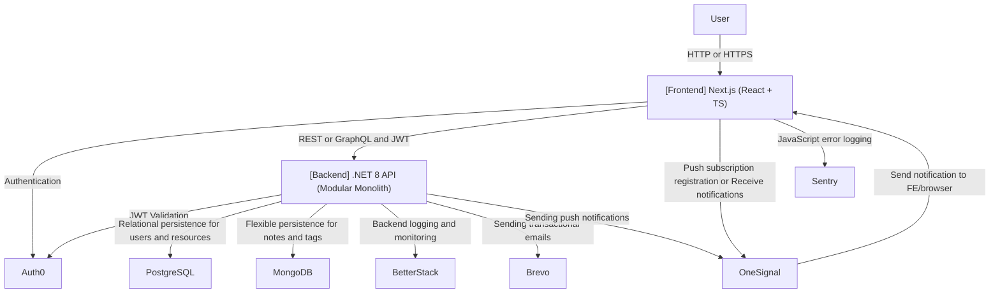

# Personal Learning Resource Tracker

> Organize, track, and reflect on your learning resources in one place.

## 📚 Overview

Personal Learning Resource Tracker is a full-stack web application to help users manage, prioritize, and reflect on learning materials (books, articles, videos, courses, etc.), supporting notes, progress tracking, tags, and notifications.

---

## 🚀 Tech Stack

- **Frontend:** Next.js (React + TypeScript)
- **Backend:** .NET 8 API (Modular Monolith)
- **Database:** PostgreSQL (relational), MongoDB (NoSQL, for notes/tags)
- **Authentication:** Auth0
- **CI/CD:** GitHub Actions
- **Logs/Monitoring:** BetterStack, Sentry
- **Emails:** Brevo (transactional)
- **Push Notifications:** OneSignal

---

## 🗂️ Monorepo Structure

```
apps/
  frontend/    # Next.js app
  backend/     # .NET API
docs/
  architecture/   # Diagrams, architecture docs
.github/
  workflows/      # CI/CD workflows
```

---

## 🏗️ Architecture Diagram




---

## 🛠️ Getting Started

1. Clone the repo:
   ```bash
   git clone https://github.com/kloudja/personal-learning-resource-tracker.git
   cd personal-learning-resource-tracker
   ```
2. Install dependencies for each app (`apps/frontend`, `apps/backend`)
3. Configure environment variables (`.env`)
4. Start the development servers

---

## 🤝 Contributing

Contributions are welcome!\
Open issues or pull requests for improvements, ideas, or bugs.

---

## 📄 License

[MIT](LICENSE)

